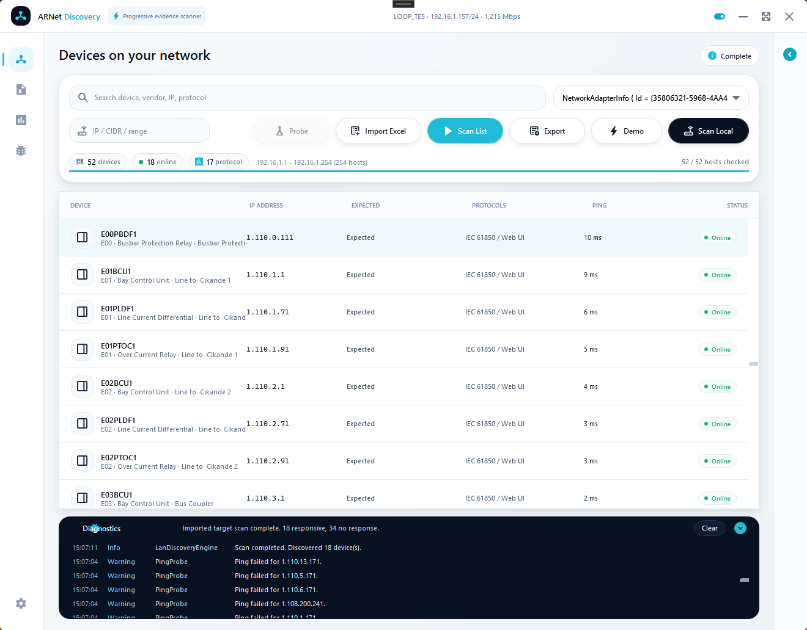

# ARNet Discovery - Windows Substation LAN Scanner for Relay IP & Protocol Evidence

<p align="left">
  <a href="https://github.com/masarray/ARNetDiscovery/actions/workflows/ci.yml"></a>
  <a href="https://github.com/masarray/ARNetDiscovery/actions/workflows/release-package.yml"></a>
  <a href="https://github.com/masarray/ARNetDiscovery/actions/workflows/pages.yml"></a>
  <a href="https://github.com/masarray/ARNetDiscovery/releases/latest"></a>
  
  
  
</p>

**ARNet Discovery** is a free, open-source Windows desktop app for substation LAN discovery, relay IP scanning, imported target-list verification, and lightweight protocol evidence checks. It helps engineers quickly see which IEDs, protection relays, bay controllers, gateways, switches, SCADA servers, workstations, meters, printers, and web-managed devices are visible from a laptop during FAT, SAT, commissioning, lab validation, and troubleshooting.

The release package is portable: download the ZIP, extract it, and run `ARNetDiscovery.exe`. No installer, subscription, license key, or Visual Studio installation is required.

<p align="center">
  <a href="https://masarray.github.io/ARNetDiscovery/">
    
  </a>
</p>

## What is this?

ARNet Discovery is a practical network visibility tool for engineering work on substation automation and industrial control networks. It provides a table-first workflow for checking reachability, expected IP addresses, open management ports, and common protocol evidence without turning the job into a manual ping spreadsheet.

## Who is it for?

- Protection, automation, SCADA, and commissioning engineers.
- FAT/SAT teams checking panel LANs and project IP lists.
- System integrators validating relay, gateway, server, and workstation visibility.
- Troubleshooting teams who need a clear snapshot before deeper protocol or cyber-security testing.

## Why use it?

- Verify an official Excel/CSV/TXT target list instead of scanning unnecessary addresses.
- See expected devices first, then watch evidence update progressively.
- Keep ping, MAC, vendor, open ports, protocol candidates, diagnostics, and selected-device details in one screen.
- Export CSV results for FAT records, commissioning notes, punch-list follow-up, or troubleshooting handover.
- Use conservative scan behavior that avoids accidentally scanning huge address spaces from broad subnet masks.

## Key features

- **Scan Local** - discover nearby devices from the selected adapter with a safe scan window.
- **Probe** - test a single IP address, CIDR block, or bounded IP range.
- **Import Excel / CSV / TXT** - load a project target list and scan the exact expected IP addresses.
- **Progressive discovery** - devices appear quickly while background evidence checks continue.
- **Protocol evidence** - check common evidence for IEC 61850 MMS, IEC 60870-5-104, Modbus TCP, DNP3 TCP, OPC UA, HTTP/HTTPS, SSH, and Telnet.
- **Device classification** - identify likely relays/IEDs, BCUs, gateways/RTUs, switches, servers/workstations, meters/PLCs, printers, and web-managed devices from available evidence.
- **Collapsible inspector** - review selected-device details without losing the main table.
- **Diagnostics drawer** - keep scan messages, timeouts, and warnings visible when needed.
- **CSV export** - save results for engineering records and follow-up.
- **Portable Windows release** - ready-to-run ZIP package built by GitHub Actions.

## Screenshots


## Download / Install / Run

Download the latest package from [GitHub Releases](https://github.com/masarray/ARNetDiscovery/releases/latest):

```text
ARNetDiscovery-v<version>-win-x64-portable.zip
SHA256SUMS.txt
```

Run the app:

1. Extract the ZIP to a local folder.
2. Run `ARNetDiscovery.exe`.
3. Select the Ethernet adapter connected to the engineering LAN.
4. Use **Scan Local**, **Probe**, or **Import Excel** + **Scan List**.
5. Review the results and export CSV when needed.

The package includes quick-start and user-manual PDFs, license files, notices, and checksum information.

## Quick start

1. Connect the laptop to the panel LAN, relay switch, test bench, or engineering network.
2. Open ARNet Discovery.
3. Select the correct Ethernet adapter.
4. Choose the scan mode:
   - **Scan Local** for nearby devices.
   - **Probe** for a known IP, CIDR block, or bounded range.
   - **Import Excel** + **Scan List** for official project target verification.
5. Select a row to review evidence in the inspector.
6. Open diagnostics when you need scan messages or timeout notes.
7. Export CSV for FAT, SAT, commissioning, or troubleshooting records.

## How it works

ARNet Discovery performs conservative reachability and evidence checks. A detected open port is shown as engineering evidence, not as a final identity guarantee.

| Evidence | Default port | Typical interpretation |
|---|---:|---|
| IEC 61850 MMS / ISO-on-TCP | 102 | protection relay, BCU, IED, or gateway candidate |
| IEC 60870-5-104 | 2404 | RTU, gateway, automation controller candidate |
| Modbus TCP | 502 | PLC, meter, gateway, or controller candidate |
| DNP3 TCP | 20000 | outstation, RTU, or gateway candidate |
| OPC UA | 4840 | SCADA, server, workstation, or OPC server candidate |
| HTTP / HTTPS | 80 / 443 | web-managed device, switch, server, or relay web UI candidate |
| SSH / Telnet | 22 / 23 | switch, router, gateway, or server management candidate |

Use the result as a fast field snapshot, then follow the formal project procedure for final protocol, protection, and cyber-security validation.

## Build from source

### Requirements

- Windows
- Visual Studio with the **.NET desktop development** workload
- .NET 8 SDK

### Build in Visual Studio

1. Open `ARNetDiscovery.sln`.
2. Set `ARNetDiscovery.Wpf` as the startup project.
3. Build and run.

### Build portable package with PowerShell

```powershell
PowerShell -ExecutionPolicy Bypass -File .\scripts\publish-windows-portable.ps1 -Version v2.16.0
```

The package is created in:

```text
artifacts/release/ARNetDiscovery-v2.16.0-win-x64-portable.zip
artifacts/release/SHA256SUMS.txt
```

Verify the package:

```powershell
PowerShell -ExecutionPolicy Bypass -File .\scripts\verify-release-package.ps1 `
  -ZipPath .\artifacts\release\ARNetDiscovery-v2.16.0-win-x64-portable.zip `
  -ChecksumPath .\artifacts\release\SHA256SUMS.txt
```

## Documentation

- [Product page](https://masarray.github.io/ARNetDiscovery/)
- [Quick Start](docs/QUICK_START.md)
- [User Manual](docs/USER_MANUAL.md)
- [Troubleshooting](docs/TROUBLESHOOTING.md)
- [Release Packaging](docs/RELEASE_PACKAGING.md)
- [GitHub Pages Deployment](docs/DEPLOYMENT.md)
- [Validation Matrix](docs/VALIDATION_MATRIX.md)
- [Roadmap](docs/ROADMAP.md)
- [Contributing](CONTRIBUTING.md)
- [Security](SECURITY.md)

## Roadmap

Planned improvements focus on better evidence quality, clearer reports, and safer engineering workflows:

- richer protocol validators for IEC 61850, OPC UA, Modbus TCP, and HTTP metadata;
- saved scan sessions for repeat FAT and commissioning checks;
- formatted evidence reports;
- stronger imported target-list mapping and preview;
- automated tests for subnet parsing, target import, device classification, and snapshot buffering;
- accessibility and keyboard-navigation improvements.

See [Roadmap](docs/ROADMAP.md) for details.

## Contributing

Contributions are welcome when they improve reliability, evidence quality, performance, documentation, packaging, or usability.

Good contribution areas include safer protocol evidence validators, target-list import improvements, export/reporting, UI accessibility, deterministic tests, and documentation examples from realistic lab or commissioning workflows.

Please keep the app lightweight, conservative on industrial networks, and clear about what is evidence versus confirmed protocol behavior. See [Contributing](CONTRIBUTING.md).

## License

ARNet Discovery is free and open source under the [Apache License 2.0](LICENSE).

You can use, study, modify, and redistribute the project under the terms of the license. See [NOTICE](NOTICE) and [THIRD_PARTY_NOTICES](THIRD_PARTY_NOTICES.md) for distribution notes.
